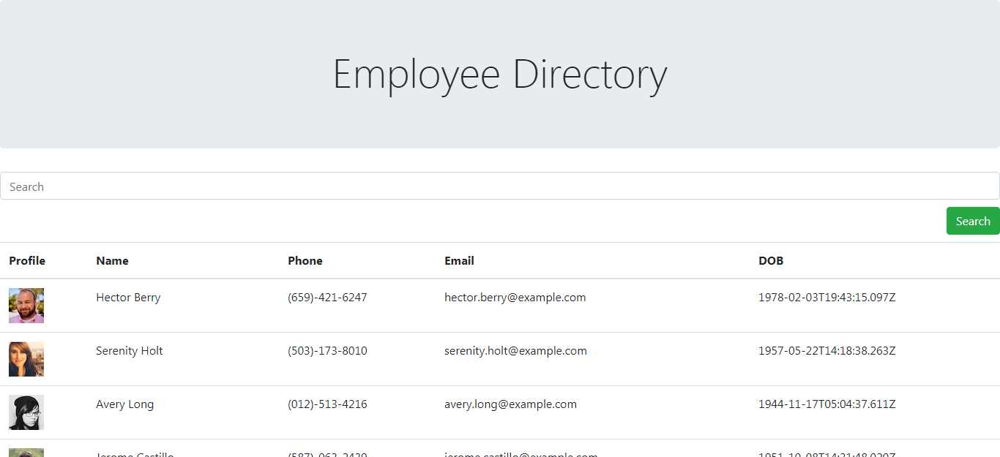

# Employee Directory

  

  ## Description
  * This application allows the user to observe their entire employee roster through the use of a React UI experience!

  ## Table of Contents
  * [Installation](#installation)
  * [Usage](#usage)
  * [License](#license)
  * [Contributing](#contributing)
  
  ## Usage
  
  ## License
  * This project is licensed under: MIT

  ## Questions
  Please contact me with any questions you may have using the links below!
  * [GitHub Profile](https://github.com/haydenrust1)
  * <haydenrust1@gmail.com>
  